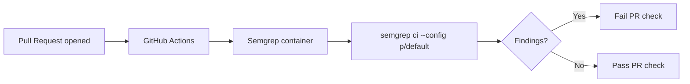

# Add Semgrep SAST Scanning workflow

## Summary

Added a `Semgrep` GitHub Actions workflow that runs Semgrep static
analysis (SAST) against every pull request, improving the repository's
security posture. The workflow runs inside the official `semgrep/semgrep`
container, executes `semgrep ci --config p/default`, and uses the
`SEMGREP_APP_TOKEN` secret when present so findings can be reported back
to the Semgrep AppSec Platform. `actions/checkout` is pinned to a
40-character commit SHA per the project's supply-chain guidelines, and
the workflow declares least-privilege `contents: read` permissions.

Closes #2.

## Evidence

This is a CI workflow addition with no UI surface, so there is nothing
to screenshot. Behaviour is verified by a new regression test suite
(`tests/semgrep-workflow.test.js`) that parses the workflow YAML and
asserts the structural invariants the security review requires.

## Test Plan

- Added `tests/semgrep-workflow.test.js` with six checks:
  - Workflow file exists at `.github/workflows/semgrep.yml`.
  - Workflow name is `Semgrep` and triggers on `pull_request`.
  - `actions/checkout` is pinned to a 40-character commit SHA.
  - Job runs inside the `semgrep/semgrep` container and executes
    `semgrep ci --config p/default`.
  - Workflow declares `permissions: contents: read`.
  - `SEMGREP_APP_TOKEN` is wired from `secrets.SEMGREP_APP_TOKEN` via
    `env:`.
- Verified the new tests pass: `node --test tests/semgrep-workflow.test.js`
  reports 6 passed / 0 failed.
- Pre-existing failure in `tests/pwa-index-freshness.test.js` is
  unrelated to this change and was present before.
