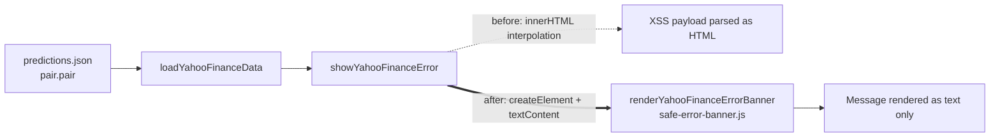

# Fix DOM XSS in showYahooFinanceError (issue #21)

## Summary

Closes #21.

`docs/index.js` previously rendered the Yahoo Finance error banner by assigning
a template literal to `errorElement.innerHTML`, interpolating an
attacker-controllable `message` value. Two call sites flow attacker content into
that sink — `FX pair ${pair.pair} is not available on Yahoo
Finance` and
`Error loading Yahoo Finance data: ${error.message}` — and both ultimately
derive from `pair.pair`, which is loaded from a contributor-controlled
`predictions.json`. A crafted pair such as `AUDCAD` would
execute on the production GitHub Pages origin.

The fix follows the same pattern issue #12 introduced for the FX pair card: a
small standalone helper (`docs/safe-error-banner.js`) builds the banner with
`document.createElement` + `textContent` (and a text node for the message), so
the message is rendered as text rather than parsed as HTML.
`showYahooFinanceError` now delegates to that helper. The new script is loaded
before `index.js` in `docs/index.html`.

## Evidence

This change is a no-visible-UI security fix — the banner still renders the same
icon plus message text; only the construction path changes. Verified via the
regression tests below. The Mermaid flow shows what moved.

## Test Plan

Added `tests/yahoo-error-banner-xss.test.ts` with 6 tests covering:

- Malicious `` payloads are rendered as HTML-encoded text
  — no raw `<img` and no unencoded element open tags survive in the output.
- The icon node (`fas fa-exclamation-triangle me-1`) plus the literal message
  text are present.
- Repeated calls clear previous children rather than accumulating them.
- A null container is tolerated (matches the old `if (errorElement)` guard).
- Source-level regression check: `showYahooFinanceError` no longer assigns to
  `innerHTML` and must delegate to `renderYahooFinanceErrorBanner`.
- `docs/index.html` loads `safe-error-banner.js` before `index.js`.

Existing `tests/fx-card-xss.test.ts` still passes (5/5). The 3 unrelated
pre-existing failures in `tests/pwa-index-freshness.test.js` and
`tests/sw-pathname-guards.test.ts` are unchanged by this PR — verified by
running the same tests on the base commit before applying the fix.
