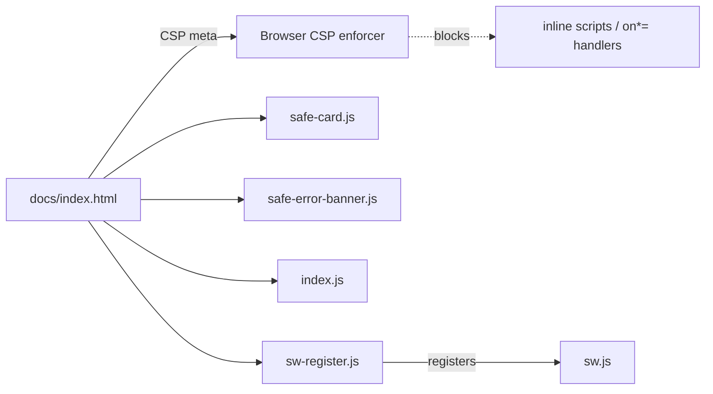

## Summary

Added a restrictive `Content-Security-Policy` meta tag to `docs/index.html` so
the GitHub-Pages-hosted dashboard now ships browser-enforced defence-in-depth
against DOM-XSS. The inline service-worker registration block was extracted to
`docs/sw-register.js`, and a leftover inline `onclick` handler in
`docs/index.js` was rewritten to use `addEventListener`, so the page can ship
the CSP without any `'unsafe-inline'` allowance on `script-src`. Closes #23.

## Evidence

CLI/backend change — no UI redesign to screenshot. Verified with a new
regression test suite (`tests/csp-meta.test.js`, 10 tests, all passing) that
parses the meta tag, walks the CSP directive map, and asserts that the HTML
and JS no longer contain inline scripts or inline event handlers that the CSP
would block.

CSP delivered in the page head:

```text
default-src 'self';
script-src  'self' https://cdn.jsdelivr.net;
style-src   'self' https://cdn.jsdelivr.net 'unsafe-inline';
img-src     'self' data:;
font-src    'self' https://cdn.jsdelivr.net;
connect-src 'self' https://query1.finance.yahoo.com https://api.allorigins.win
                  https://corsproxy.io https://thingproxy.freeboard.io;
object-src  'none';
base-uri    'self';
frame-ancestors 'none';
```

Load order after the change:



## Test Plan

- `node --test tests/csp-meta.test.js` — new file, 10 tests, all pass:
  - CSP meta tag exists with a non-empty `content`.
  - All nine required directives (`default-src`, `script-src`, `style-src`,
    `img-src`, `font-src`, `connect-src`, `object-src`, `base-uri`,
    `frame-ancestors`) are present.
  - `default-src`, `object-src`, `base-uri`, and `frame-ancestors` are locked
    down to safe values.
  - `script-src` allows `'self'` plus jsdelivr but forbids `'unsafe-inline'`
    and `'unsafe-eval'`.
  - `connect-src` enumerates every Yahoo Finance proxy origin used by
    `docs/index.js`.
  - `docs/index.html` contains no inline `<script>` bodies and no inline
    `on*=` event-handler attributes.
  - `docs/index.js` contains no inline event handlers inside template
    literals (regression guard for the previous `onclick` in
    `showValidationError`).
  - `docs/sw-register.js` exists and is referenced from `docs/index.html`.
  - `docs/sw.js` caches both `./sw-register.js` and `./safe-error-banner.js`
    in `STATIC_ASSETS`.
- `tests/pwa-index-freshness.test.js` — updated the SW-registration sanity
  check to inspect `docs/sw-register.js` (the new home of the registration
  call) while still asserting that `docs/index.html` references the extracted
  file. Documented because the registration block legitimately moved.
- All other previously-passing tests in `tests/` continue to pass.

### Pre-existing failures (NOT introduced by this PR)

Three tests under `tests/pwa-index-freshness.test.js` and
`tests/sw-pathname-guards.test.ts` related to predictions.json/CSV pathname
matching were already failing on `Develop` before this change. They are
unrelated to the CSP work and were not modified.
