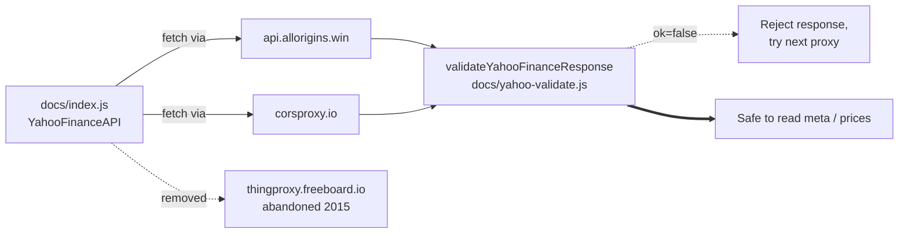

# Drop abandoned Yahoo Finance proxy and validate proxy responses (issue #24)

## Summary

Removed the abandoned `thingproxy.freeboard.io` from the `YahooFinanceAPI`
proxy list in `docs/index.js` and added a strict schema validator that
every Yahoo Finance fetch path now runs against the proxy-supplied JSON
before any field reaches a DOM sink. The CSP `connect-src` directive in
`docs/index.html` was tightened in step to drop the dropped origin.
Closes #24.

The Freeboard `thingproxy` source repo has been unmaintained since 2015,
so a domain or Heroku-app takeover would let an attacker inject arbitrary
JSON into every dashboard visit. The remaining proxies
(`api.allorigins.win`, `corsproxy.io`) are still untrusted intermediaries,
so the new validator (`docs/yahoo-validate.js`) defends against the same
class of attack: it rejects symbols that do not match `/^[A-Z]+=X$/`, any
HTML markup or `on*=`/`javascript:` content in `meta.shortName` /
`meta.longName`, non-finite numbers in timestamps, and non-numeric values
in the OHLC price arrays. Yahoo's legitimate metadata-only responses (no
`timestamp` / `indicators`) and `null` price gaps remain accepted.

## Evidence

CLI/security hardening — no UI redesign to screenshot. Verified via the
new and updated regression tests. The Mermaid flow shows the change.



Updated CSP `connect-src` (now omits `thingproxy.freeboard.io`):

```text
default-src 'self';
script-src  'self' https://cdn.jsdelivr.net;
style-src   'self' https://cdn.jsdelivr.net 'unsafe-inline';
img-src     'self' data:;
font-src    'self' https://cdn.jsdelivr.net;
connect-src 'self' https://query1.finance.yahoo.com
                  https://api.allorigins.win https://corsproxy.io;
object-src  'none';
base-uri    'self';
frame-ancestors 'none';
```

## Test Plan

- `node --test tests/yahoo-proxy-allowlist.test.js` — new file, 4 tests,
  all pass:
  - `YahooFinanceAPI.proxies` array omits `thingproxy.freeboard.io`.
  - At least one operational proxy remains so the feature still works.
  - No literal `thingproxy.freeboard.io` URL slips into the proxies array.
  - CSP `connect-src` does not list `thingproxy.freeboard.io`.
- `deno test --allow-read tests/yahoo-response-validation.test.ts` — new
  file, 13 tests, all pass:
  - Accepts a well-formed Yahoo Finance payload.
  - Rejects null / non-object / array payloads.
  - Rejects missing or empty `chart.result`.
  - Rejects malformed `meta.symbol` (case, slash, space, XSS markup, missing
    `=X`).
  - Rejects HTML markup in `meta.shortName` / `meta.longName`.
  - Accepts responses without optional `shortName` / `longName`.
  - Rejects non-finite numbers in `timestamp` arrays.
  - Tolerates metadata-only responses (no `timestamp` / `indicators`).
  - Rejects non-numeric values in `open` / `high` / `low` / `close`.
  - Allows `null` entries in price arrays (Yahoo uses `null` for gaps).
  - Regression guards: every Yahoo fetch path in `docs/index.js` calls
    `validateYahooFinanceResponse`, `docs/index.html` loads
    `yahoo-validate.js` before `index.js`, `docs/sw.js` caches it as a
    static asset.
- `node --test tests/csp-meta.test.js` — updated to drop the
  `thingproxy.freeboard.io` requirement from `connect-src` and to assert
  that `docs/sw.js` also caches `yahoo-validate.js`. 10 tests, all pass.

### Pre-existing failures (NOT introduced by this PR)

Three tests under `tests/pwa-index-freshness.test.js` and
`tests/sw-pathname-guards.test.ts` covering predictions.json / CSV pathname
matching were already failing on `Develop` before this change (see the PR
summaries for #21 and #23). They are unrelated to the proxy hardening and
were not modified here.
