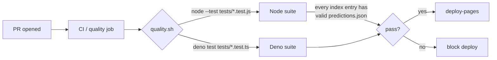

## Summary

Re-enable the test suite as a CI quality gate and fix the broken regression
guards that let issue #30 ("Failed to load prediction data" on the live site)
ship. Closes #30.

The merged PR #29 left the dashboard in a state where the auto-selected date
could resolve to a missing or unreadable `predictions.json`, producing the
"Failed to load prediction data" error the iPhone screenshot in the issue
captured. The CI pipeline never ran any tests, and the two existing regression
guards in `tests/pwa-index-freshness.test.js` and
`tests/sw-pathname-guards.test.ts` contained JavaScript string-escape bugs
that caused them to search `docs/sw.js` for substrings (`//data/.*.csv$/`,
`endsWith('.json') ...`) that the file can never contain — so they silently
failed.

What changed:

- **`quality.sh`** — single entry point that runs the Node.js
  (`tests/*.test.js`) and Deno (`tests/*.test.ts`) suites. Designed for
  unattended workers: `./quality.sh < /dev/null`.
- **`.github/workflows/ci.yml`** — new `quality` job that installs Node and
  Deno (both pinned to commit SHAs already in use by `markdown-lint.yml`) and
  runs `./quality.sh`. The `deploy-pages` job now depends on `quality`, so a
  failing test blocks the live deploy.
- **`tests/pwa-index-freshness.test.js`** — corrected escape sequences on the
  service-worker pathname assertions (`/\/data\/.*\.csv$/`,
  `/\/\d{4}-\d{2}-\d{2}\/predictions\.json$/`) and the quote style on the
  `.json` static-asset guard. Added a new test that walks every entry in
  `docs/index.json` and asserts the referenced `predictions.json` exists,
  parses, and contains a non-empty `results` array — this is the exact
  failure mode the iPhone screenshot showed.
- **`tests/sw-pathname-guards.test.ts`** — same `.json` quote fix on the Deno
  side.
- **`README.md`** — documents the new quality gate.

## Evidence

This is a CI/test fix. The new regression guard is exercised directly:



Verification that the new guard catches the regression in the issue (running
the same node test with a deleted `predictions.json`):

```
✖ Every index.json entry resolves to a valid predictions.json with results
  AssertionError: Found 1 broken index.json entries:
    2026-05-22: file does not exist (2026-05-22/predictions.json)
```

And with malformed JSON in the same file:

```
✖ Every index.json entry resolves to a valid predictions.json with results
  AssertionError: Found 1 broken index.json entries:
    2026-05-22: invalid JSON in 2026-05-22/predictions.json (...)
```

Full local run:

```
$ ./quality.sh < /dev/null
[quality] Node.js test suite (tests/*.test.js)
ℹ tests 78  ℹ pass 78  ℹ fail 0
[quality] Deno test suite (tests/*.test.ts)
ok | 36 passed | 0 failed (165ms)
[quality] All checks passed.
```

The two service-worker guards now exercise the source they were always meant
to: prior to the fix they were searching for strings such as `//data/.*.csv$/`
(JavaScript collapses `\/` to `/`) which can never appear in a regex literal.

## Test Plan

- Added `tests/pwa-index-freshness.test.js::"Every index.json entry resolves
  to a valid predictions.json with results"` — fails when any entry's
  `predictions.json` is missing, unparseable, or contains an empty `results`
  array.
- Fixed `tests/pwa-index-freshness.test.js::"Service worker treats
  predictions.json and CSV data files as dynamic (pathname-based)"` — now
  actually checks `docs/sw.js` for the regex sources it claims to.
- Fixed `tests/pwa-index-freshness.test.js::"Service worker does not treat
  predictions.json as a static JSON asset"` — quote style now matches
  `sw.js`.
- Fixed `tests/sw-pathname-guards.test.ts::"sw.js does not treat
  predictions.json as a cache-first static JSON asset"` — same quote fix.
- New `quality` job in `.github/workflows/ci.yml` runs `./quality.sh`;
  `deploy-pages` depends on it.
- `tests/ci-workflow.test.js` still passes — every newly-introduced
  `uses:` action is pinned to a 40-character commit SHA.
