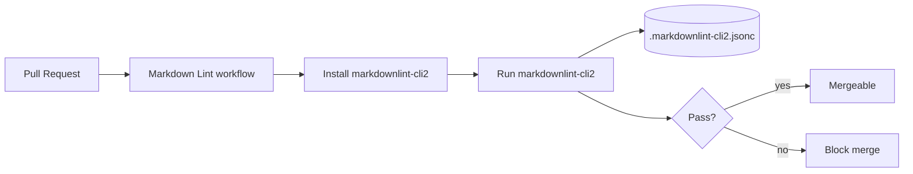

## Summary

Added the **Markdown Lint** GitHub Actions workflow at
`.github/workflows/markdown-lint.yml`, plus a project-level
`.markdownlint-cli2.jsonc` configuration so the gate runs against every
Markdown file in the repository. Existing Markdown files were
auto-fixed (blank lines around headings, lists and fences, trailing
newlines, table column style) so the new gate passes cleanly on
`Develop`. Closes #4.

## Evidence

This is a CI/infra change — no UI surface to screenshot. Verification:

- `markdownlint-cli2` was run locally with the new config and reports
  `Summary: 0 error(s)` across all 11 Markdown files in the repo.
- Third-party actions in the workflow are pinned to 40-character commit
  SHAs (`actions/checkout`, `actions/setup-node`, `denoland/setup-deno`)
  per the supply-chain guidance in the coding guidelines.
- The optional Mermaid validation step is gated by a `worker/deno/mod.ts`
  presence check, so it is silently skipped in this repo (no Deno worker
  module present).
- Workflow uses least-privilege `permissions: contents: read`.

## Test Plan

- Added `tests/markdown-lint-workflow.test.js` which calls real
  `node:fs` reads and asserts on the actual workflow and config files:
  - Workflow file exists at the expected path.
  - `name: Markdown Lint` and both `pull_request:` and `push:` triggers
    are present.
  - Each third-party action `uses:` reference is pinned to a 40-char
    commit SHA (regex enforced).
  - The install + run lines for `markdownlint-cli2` are present.
  - `permissions: contents: read` is declared.
  - `.markdownlint-cli2.jsonc` parses as JSONC and exposes `globs` plus
    a `config` block.
- Ran `node --test tests/markdown-lint-workflow.test.js` — all 6 tests
  pass.
- Ran `markdownlint-cli2` locally — 0 errors across 11 Markdown files.
